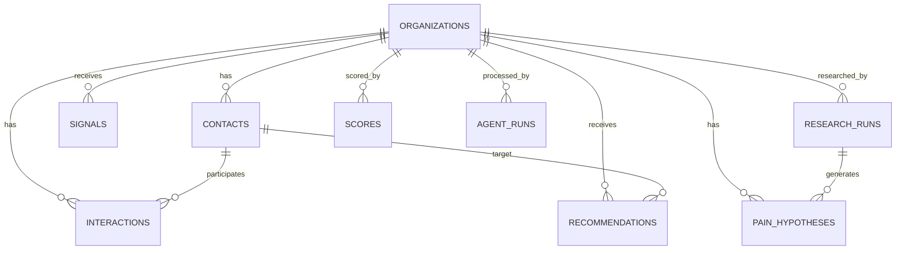

# Data Contract V1.0 — Transformativa Revenue Engine

**Versão:** 1.0 · **Congelado em:** 29/09/2026 · **Card:** `TRE-W0-E03-T01` · **Status:** congelado (W0)

**Autoridade (hierarquia do baseline V1.1.0):** doc **12** (Contratos e Governança) > doc **04** (Projeto
Físico de Dados) > doc **06** (Integrações e Fluxos) > doc **03** (Arquitetura de Negócio) > doc **05** (MER).
Este documento **consolida** o que o baseline já define — não introduz regra nova. Onde o baseline é omisso,
o contrato diz explicitamente que é omisso em vez de inventar.

**Âmbito:** dados de inteligência comercial (Sales Intelligence) em PostgreSQL, o espelho operacional em Odoo,
os eventos entre eles e os vocabulários/scores que os governam.

**Artefatos versionados:**

| Artefato | Papel |
|---|---|
| `db/migrations/0001_sales_intelligence_v1.sql` | schema congelado (DDL das 12 tabelas + índices) — fonte única das colunas |
| `docs/data/DATA_CONTRACT_V1.md` | este documento: contrato legível |
| `docs/data/data_contract_v1.json` | contrato legível por máquina (ownership, eventos, vocabulários, scores) |
| `scripts/verificar_contrato_dados.py` | prova que os três não divergem entre si |

---

## 1. Bancos

| Base | Papel |
|---|---|
| `odoo` | operação comercial (estado corrente do funil) |
| `sales_intelligence` / schema `sales_intelligence` | inteligência, histórico e auditoria |

## 2. Source of truth

Ninguém é dono de tudo: cada informação tem **um** dono. Conflito se resolve pelo dono, nunca por quem
escreveu por último.

| Informação | Dono |
|---|---|
| empresa pesquisada | PostgreSQL |
| sinais | PostgreSQL |
| research | PostgreSQL |
| scores | PostgreSQL |
| hipóteses de IA | PostgreSQL |
| contato comercial | Odoo |
| estágio | Odoo |
| atividade | Odoo |
| reunião | Odoo |
| proposta | Odoo |
| valor | Odoo |
| won/lost | Odoo |
| motivo de perda | Odoo |

## 3. IDs canônicos

- **Chave canônica:** `id UUID` é PK em **todas** as 12 tabelas. É o identificador que o Transformativa
  Revenue Engine usa em código, evento, log e log de auditoria.
- **IDs de sistema externo são referência, nunca identidade:** `odoo_partner_id` (organizations, contacts),
  `odoo_lead_id` (interactions) e `production_promoted_task_ids`-style chaves de terceiros entram como
  coluna própria e **nunca substituem** o UUID canônico (doc 05 §4: "IDs internos Odoo nunca substituem IDs
  canônicos Transformativa").
- **Mapeamento canônico ↔ Odoo** (doc 05 §3-4):

| Canônico | Odoo |
|---|---|
| `organizations.id` | `res.partner.tf_company_id` |
| oportunidade canônica | `crm.lead.tf_opportunity_id` |
| `contacts.id` | `res.partner` (via `odoo_partner_id`) |
| score de prioridade | `res.partner.tf_priority_score`, `crm.lead.tf_priority_score` |

- **Oportunidade canônica:** o baseline **não** cria tabela de oportunidade no PostgreSQL — a oportunidade
  canônica referencia `crm.lead.tf_opportunity_id` (Odoo é o dono). Por isso
  `recommendations.opportunity_id` é UUID **sem** FK declarada na V1: o vínculo é lógico, com o Odoo.
- **Geração:** UUID v4 no produtor do fato (Hermes/agente ou n8n), **antes** de qualquer chamada externa —
  o ID nasce no sistema que testemunhou o fato, não no sistema que o espelhou.
- **Correlação:** `agent_runs.correlation_id` liga uma cadeia de execução (agente → workflow → evento).
  `sync_events.idempotency_key` é única por operação.

## 4. Schema

Fonte única das colunas: `db/migrations/0001_sales_intelligence_v1.sql`.

| # | Tabela | Papel |
|---|---|---|
| 1 | `organizations` | empresa pesquisada |
| 2 | `contacts` | contato comercial |
| 3 | `signals` | sinal de mudança/demanda |
| 4 | `research_runs` | execução de pesquisa por agente |
| 5 | `pain_hypotheses` | hipótese de dor (inferência) |
| 6 | `scores` | score calculado, versionado |
| 7 | `interactions` | interação em qualquer canal |
| 8 | `recommendations` | próximo passo recomendado |
| 9 | `agent_runs` | auditoria de execução de agente |
| 10 | `outbox_events` | Outbox Pattern (PG → n8n → Odoo) |
| 11 | `sync_events` | trilha de sincronização e idempotência |
| 12 | `human_approvals` | aprovação humana registrada |

**Regras de schema:**

- toda tabela tem PK `id UUID`; toda FK aponta para `id` de tabela do mesmo schema (verificado por script);
- `created_at`/`updated_at` em `TIMESTAMPTZ`; `deleted_at` só em `organizations` (soft delete declarado);
- auditoria de IA é coluna **estruturada** (`agent_name`, `agent_version`, `model_provider`, `model_name`,
  `prompt_version`, `input_hash`), não texto livre — sem isso não há reprodutibilidade;
- índices mínimos: os 16 do doc 04 §15, aplicados na migration (o `UNIQUE` de `idempotency_key` já cobre o
  décimo sexto);
- **vínculos lógicos sem FK na V1** (declarados, não inventados): `signals.research_run_id`,
  `recommendations.opportunity_id`, `interactions.campaign_id`. Decisão de virar FK pertence ao W1.

### 4.1 ER (visão)

O ER completo está no baseline (doc 05). Esta é a visão que o contrato congela — o verificador garante que
ela corresponde ao SQL:



Entidades técnicas (`outbox_events`, `sync_events`, `human_approvals`) **não** têm FK para entidades de
negócio: referenciam por `aggregate_id` / `entity_id` + `entity_type`. É deliberado — evento e aprovação
precisam sobreviver ao fato que os originou, e uma FK forte impediria isso.

## 5. Deduplicação de empresa

- **Identificadores fortes:** CNPJ → domain → LinkedIn Company URL.
- **Identificadores fracos:** nome + cidade; nome + telefone; nome + endereço.
- **Merge automático somente com** `entity_match_confidence >= 0.95`. Abaixo disso:
  `REVIEW_REQUIRED` — fila humana, **nunca** merge silencioso.
- Ambiguidade não é resolvida por heurística: é reportada (`doc 06 §8`: "nunca corrigir silenciosamente
  dados ambíguos").

## 6. Eventos

**Envelope único** (doc 12 §2-3), com versão explícita — `event_version` é obrigatório em todo evento:

```json
{
  "event_type": "COMPANY_QUALIFIED",
  "event_version": "1.0",
  "timestamp": "ISO-8601",
  "payload": { }
}
```

**PostgreSQL → Odoo** (via `outbox_events`, consumido pelo n8n):
`COMPANY_QUALIFIED`, `COMPANY_UPDATED`, `PRIORITY_SCORE_CHANGED`, `DECISION_MAKER_FOUND`,
`NEXT_BEST_ACTION_CHANGED`, `OPPORTUNITY_RECOMMENDED`.

**Odoo → PostgreSQL**: `STAGE_CHANGED`, `ACTIVITY_COMPLETED`, `MEETING_CREATED`, `OPPORTUNITY_WON`,
`OPPORTUNITY_LOST`, `DEAL_VALUE_CHANGED`, `LOSS_REASON_RECORDED`.

**Regras de integração** (doc 06 §7-8):

1. toda integração tem `idempotency_key` + correlação + retry limitado + registro em `sync_events` +
   estado de erro (dead-letter);
2. **retry não pode criar duplicata** — o consumo é idempotente pela chave;
3. falha não é engolida: vai para dead-letter **com motivo**, visível;
4. **reconciliação diária**: comparar entidades esperadas, conferir IDs cruzados, listar eventos pendentes,
   detectar divergência e **gerar relatório** — sem corrigir nada silenciosamente;
5. evento sem `event_version` é recusado (não se interpreta versão por suposição).

## 7. Vocabulários fechados

| Vocabulário | Valores |
|---|---|
| `organizations.status` | `DISCOVERED` + os estágios do funil (§7.1) |
| `human_approvals.status` | `PENDING`, `APPROVED`, `REJECTED`, `EXPIRED` |
| `recommendations.status` | `OPEN`, `APPROVED`, `REJECTED`, `EXECUTED`, `EXPIRED`, `SUPERSEDED` |
| `pain_hypotheses.status` | `HYPOTHESIS`, `VALIDATED`, `PARTIALLY_VALIDATED`, `REJECTED`, `STALE` |
| `employee_band` | `LT_70`, `70_149`, `150_299`, `300_499`, `500_699`, `700_1000`, `GT_1000`, `UNKNOWN` |
| `decision_role` | `Economic Buyer`, `Decision Maker`, `Influencer`, `Champion`, `User`, `Blocker`, `Unknown` |
| `signal_type` | `GROWTH`, `HIRING`, `NEW_EXECUTIVE`, `NEW_LOCATION`, `ERP_CHANGE`, `CRM_CHANGE`, `DIGITAL_TRANSFORMATION`, `AI_INITIATIVE`, `M_AND_A`, `NEW_PRODUCT`, `TECH_ADOPTION`, `FUNDING`, `PROCESS_COMPLEXITY`, `CUSTOMER_COMPLAINT`, `SERVICE_VOLUME`, `REGULATORY_CHANGE`, `EFFICIENCY_PROGRAM`, `COST_REDUCTION` |
| `next_best_action` | `RESEARCH_MORE`, `FIND_DECISION_MAKER`, `SEND_EMAIL`, `PREPARE_LINKEDIN`, `WAIT`, `FOLLOW_UP`, `CREATE_MEETING`, `NURTURE`, `DISQUALIFY` |

### 7.1 Funil (estágios, dono Odoo)

`Descoberto → Pesquisado → Qualificado → Contato identificado → Abordagem iniciada → Engajamento →
Reunião → Diagnóstico → Proposta → Negociação → Won | Lost`, com `Nurture` como ramo lateral a partir de
`Qualificado`.

## 8. Score model

Cinco scores, todos persistidos em `scores` com `score_type` + `score_version` (score sem versão não é
reprodutível e é recusado):

| Score | O que mede |
|---|---|
| `ICP` | fit estrutural com o cliente desejado |
| `AUTOMATION_FIT` | probabilidade de existir oportunidade relevante de automação/IA |
| `BUYING_SIGNAL` | força e atualidade dos sinais de mudança/demanda |
| `DATA_QUALITY` | confiabilidade e completude dos dados |
| `PRIORITY` | priorização de trabalho |

**Fórmula V1 do Priority Score** (doc 03 §3):

```text
PRIORITY = 0.35 * ICP
         + 0.30 * AUTOMATION_FIT
         + 0.25 * BUYING_SIGNAL
         + 0.10 * DATA_QUALITY
```

Pesos somam exatamente 1,00 (verificado por script). Mudança de peso = **nova versão do contrato**:
o score é histórico, não mutável.

**Tiering:** `A+` 90–100 · `A` 80–89,99 · `B` 65–79,99 · `C` 50–64,99 · `Nurture` < 50.
As faixas cobrem 0–100 sem lacuna e sem sobreposição (verificado por script).

**ICP (contexto de negócio):** 70–1.000 colaboradores, sweet spot 150–700. ICPs: Distribuidores B2B,
Indústrias médias, Serviços B2B, Logística, SaaS/Tech B2B. Decisores: CEO/Founder, COO, CFO, CIO/CTO, CRO,
Diretor Administrativo, CX.

## 9. Compliance e privacidade

**Campos mínimos** (doc 12 §7) — presentes no schema: `legal_basis`, `source`, `do_not_contact`,
`opt_out_email`, `opt_out_whatsapp`, `preferred_channel` (contacts) e `source` (organizations).
`collected_at` e `retention_until` **não existem** nas tabelas da V1: são lacuna declarada do baseline,
registrada para o W1 — o contrato não finge que existem.

**Regras** (doc 12 §8):

- inferência é marcada como inferência (hipótese ≠ fato);
- conservar evidência (`evidence`, `source_url`);
- **não contatar opt-out** — `do_not_contact`/`opt_out_*` são bloqueio, não preferência;
- ação sensível exige approval (`human_approvals`);
- registrar o operador humano em toda decisão (`decided_by`, `decision_notes`);
- preservar o audit trail (`agent_runs`, `sync_events`, `outbox_events`).

## 10. Governança da mudança

- **Exige nova versão do contrato (1.1, 2.0):** criar/remover tabela, coluna ou índice; mudar tipo; mudar
  vocabulário fechado; mudar fórmula/peso de score; mudar dono de uma informação; mudar envelope de evento.
- **Não exige:** comentário, índice adicional puramente operacional (registrado na migration seguinte).
- **Como muda:** migration nova e versionada em `db/migrations` (nunca editar migration já aplicada) +
  atualização deste documento + `data_contract_v1.json` + `CHANGELOG.md`, com o verificador passando.
- **Quem aprova:** mudança de contrato é **decisão estrutural** → exige aprovação humana registrada
  (`docs/operations/registro-de-aprovacoes.md`), conforme ADR-0004.
- **Definition of Done documental** (doc 10 §8): schema mudou e ER não → o card não está VERIFIED.
- **Aplicação:** nenhuma DDL nasce em produção (ADR-005) — dev → homologação → produção, pelo runner do W1.

---

*Contrato congelado no W0. Qualquer divergência entre este texto, o JSON e o SQL é falha de contrato, e o
verificador `scripts/verificar_contrato_dados.py` tem de acusar.*
